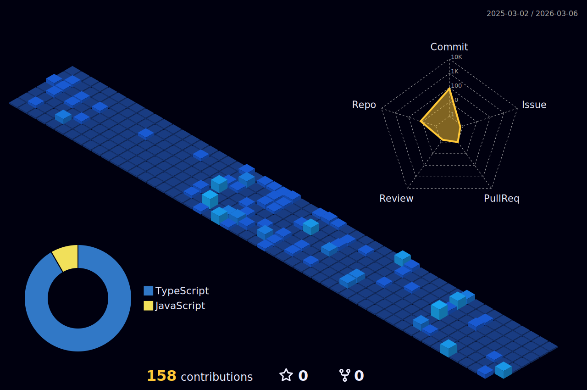

# 👋 Olá! Eu sou José Sanches Malassise

🎨 **Desenvolvedor Front-end** com foco em criar interfaces dinâmicas e responsivas, buscando sempre aprimorar minhas habilidades e acompanhar as inovações do mercado.

---

### 📚 Sobre mim
- 🌱 **Atualmente trabalhando** com tecnologias do _Front-end stack_.
- 🎯 **Objetivo**: Tornar-me especialista no desenvolvimento de interfaces com foco na experiência do usuário e nas melhores práticas de acessibilidade.
- 💼 **Experiência**: Mais de 2 anos de atuação no mercado, atualmente como **desenvolvedor pleno**.
- 💡 **Interesses**: Além de programação, tenho interesse em **design de interfaces** e **usabilidade**.

### 🛠️ Principais Tecnologias

 
  
  
  
  
  
  
  

---

### 📫 Contato
- ✉️ Email: [josemanoelmalassise@gmail.com](mailto:josemanoelmalassise@gmail.com)
- 💼 LinkedIn: [José Sanches](https://www.linkedin.com/in/seu-username-linkedin)
- 📸 Instagram: [@josemanoelsanches](https://instagram.com/josemanoelsanches)

 
   
  
   

---

---

### 🌐 Projetos em destaque
- **Projeto 1**: Descrição breve do projeto, as tecnologias utilizadas e o link para o repositório.
- **Projeto 2**: Outro projeto relevante para mostrar suas habilidades.

---

### 🌱 Aprendizado Contínuo
- 📚 Atualmente estudando **[Javascript, Typescript, NextJs, ReactJs]** para expandir meus conhecimentos.

---

> "Desenvolver é uma jornada de aprendizado constante, e cada projeto é uma oportunidade de crescer." 

---

